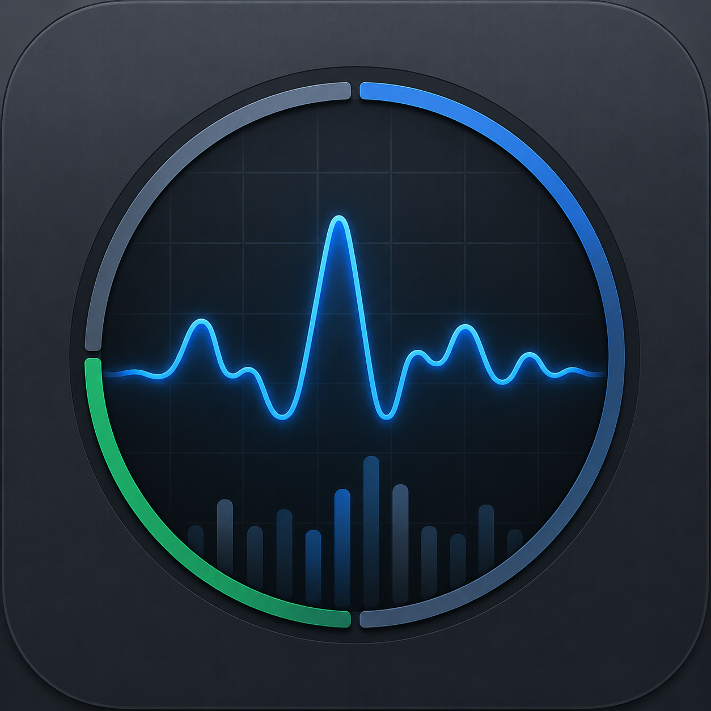

<div align="center">



# Sullybase System Telemetry Monitor

**v1.0.0**

---

*Made fully by AI*

</div>

## 🎯 What is Sullybase System Telemetry Monitor?

Sullybase System Telemetry Monitor is a native macOS app that gives you real-time insight into your Mac's performance. See live CPU, RAM, GPU, disk, network, and power metrics at a glance. Run comprehensive stress tests to benchmark your system's capabilities. Everything stays on your Mac—no network, no cloud, no external servers.

---

## ✨ Key Features

- **Live System Metrics** — Real-time readouts for CPU (overall + per-core), memory, GPU, disk usage, network throughput, battery status, and system information (chip, OS, serial number, uptime).

- **Live Preview Bars** — Three refreshing bars showing CPU, RAM, and GPU usage updated every second.

- **Device Naming** — Rename your Mac for personal identification; stored locally only.

- **Stress Benchmarks** — Run comprehensive tests:
  - **CPU Test** — Multithreaded matrix multiplication via Accelerate framework
  - **RAM Test** — Memory bandwidth measurement via read-modify-write sweeps
  - **GPU Test** — Metal-based GPU throughput benchmark (Metal-capable Macs only)
  - **LLM Stats** — Synthetic estimate of local LLM performance potential
  - **Full Suite** — Runs all tests sequentially with combined scoring (0–100)

- **Benchmark Results** — All results automatically saved as JSON and human-readable reports.

- **Connection Log** — Rolling event log of app activity.

- **100% Offline** — No internet required. No external dependencies. Everything runs locally.

---

## 🚀 Quick Start

### Requirements

- **Apple Silicon Mac** (M1 or newer)
- **macOS 13 (Ventura)** or newer

### Installation

1. Go to the [releases page](https://github.com/sullydux/System-Telemetry-Monitor/releases/latest)
2. Download the ZIP file
3. Unzip it and move it to your applications folder
4. Open it

---

## 📊 Understanding the Benchmarks

| Test | Purpose | Output |
|------|---------|--------|
| **CPU** | Measure multithreaded CPU throughput | Matrix multiplications per second |
| **RAM** | Measure memory bandwidth | Bytes moved per second |
| **GPU** | Measure GPU compute performance | GPU kernel throughput (if available) |
| **LLM Stats** | Estimate local LLM suitability | Memory footprint, KV-cache, tokens/sec for various model sizes |
| **Full Suite** | Comprehensive system score | Combined 0–100 performance score |

All benchmark results are saved locally for future reference.

---

## 💾 Where Your Data Lives

Everything Sullybase System Telemetry Monitor creates is stored locally on your Mac:

```
~/Library/Application Support/Sullybase-Telemetry/
├── preferences.json           # Device name and settings
├── stress-results.json        # Benchmark history (up to 200 runs)
├── connection.log             # Event log
└── stress-results/            # Detailed reports
    └── run-<timestamp>-<test>.txt
```

You can view and export results directly from the app or access them via:
```bash
open "$HOME/Library/Application Support/Sullybase-Telemetry/stress-results"
```

---

## 🔒 Privacy & Security

- **Completely local.** No servers, no network, no remote dashboards.
- **Fully offline.** Works without any internet connection.
- **Your data stays yours.** Everything is stored on your Mac only.
- **No tracking.** Zero telemetry sent anywhere.

---

## ❓ Troubleshooting

**App won't open with "unidentified developer" message**

Right-click the app and select **Open**, then confirm in the dialog. Or run:
```bash
xattr -dr com.apple.quarantine "build/Sullybase System Telemetry Monitor.app"
```

**GPU test shows unavailable**

Your Mac may not have a Metal-capable GPU, or it's running on an unsupported configuration. Run `system_profiler SPDisplaysDataType` to check.

**Want to reset all data?**

```bash
rm -rf "$HOME/Library/Application Support/Sullybase-Telemetry"
```

---

## Updates

- View on external device over the wifi you are on. no greater internet sharing.
- Menubar integration

---

**Built with Swift and SwiftUI for macOS. Made fully by AI.**
